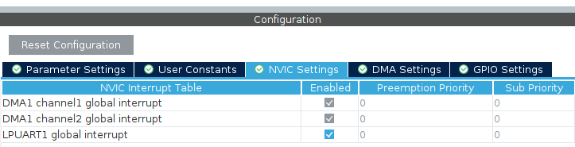
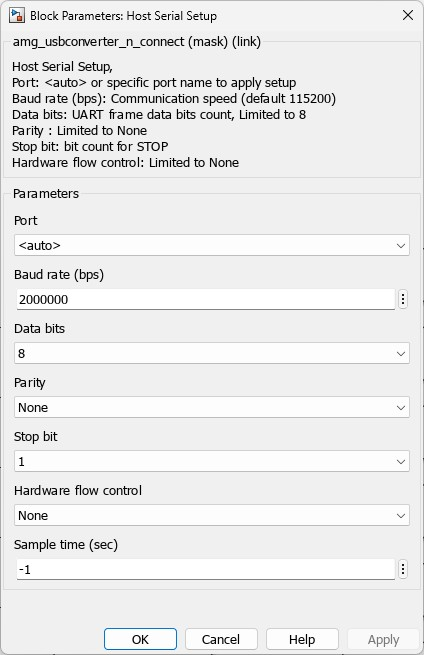
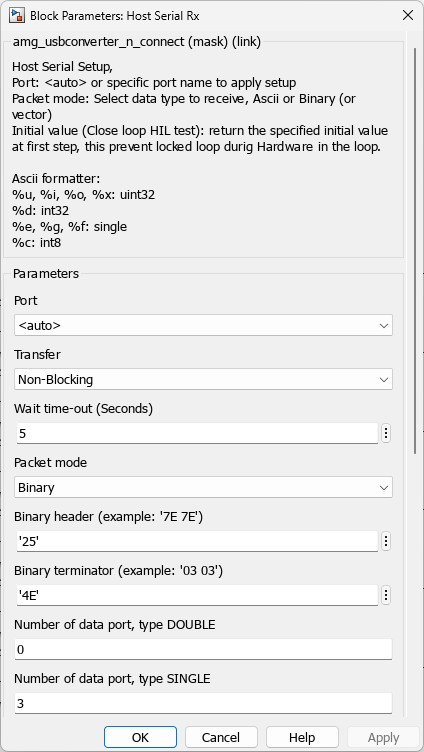
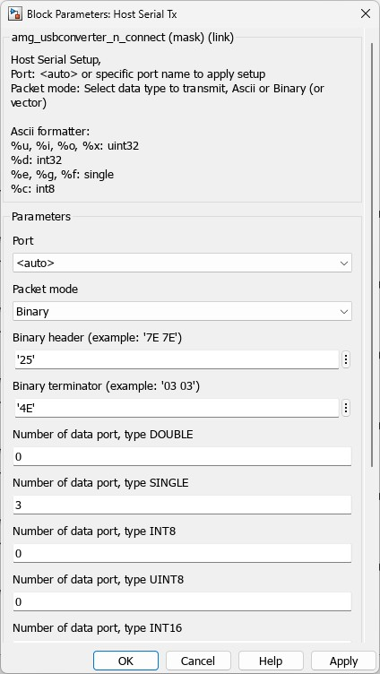
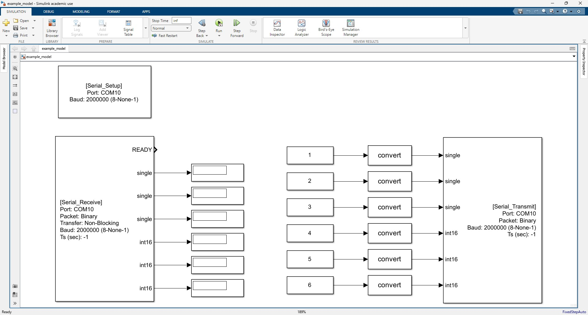
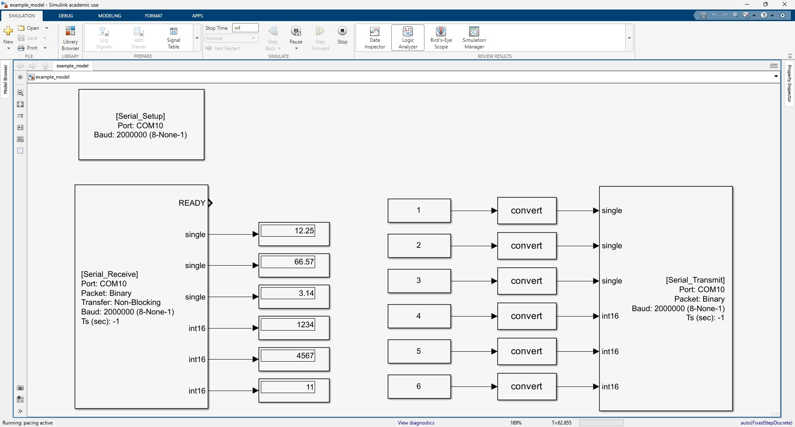
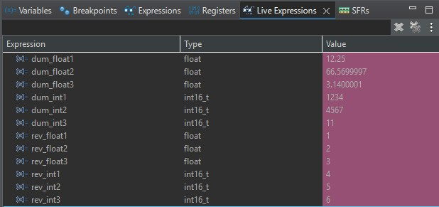

# SerialFrame — STM32-MATLAB/Simulink Bidirectional Serial Communication Library


SerialFrame is a lightweight C library for exchanging structured data between an
STM32 microcontroller and MATLAB/Simulink over a serial (UART) link. It builds
and parses fixed-layout binary frames so you can stream named variables in both
directions without hand-writing buffer offsets. The MATLAB side uses the Waijung blockset, which talks to the same
frame format with its Serial blocks.

This repository contains a complete, working STM32CubeIDE example for the
**ST Nucleo-G474RE** board that transmits and receives three `float` values and
three `int16` values at 1 kHz.

## Table of Contents

- [Features](#features)
- [Requirements](#requirements)
- [Project Structure](#project-structure)
- [How It Works — Frame Format](#how-it-works--frame-format)
- [Step 1 — Add SerialFrame to Your Project](#step-1--add-serialframe-to-your-project)
- [Step 2 — Configure the STM32 (CubeIDE)](#step-2--configure-the-stm32-cubeide)
- [Step 3 — Write the STM32 Application Code](#step-3--write-the-stm32-application-code)
- [Step 4 — Set Up MATLAB with Waijung](#step-4--set-up-matlab-with-waijung)
- [Step 5 — Run It](#step-5--run-it)
- [Using the Library](#using-the-library)
- [Frame Size](#frame-size)
- [Memory](#memory)
- [Tips and Troubleshooting](#tips-and-troubleshooting)

## Features

- Send and receive named fields of any supported type in one frame
- Supported types: `uint8`, `int8`, `uint16`, `int16`, `uint32`, `int32`, `float`, `double`
- Automatic frame layout — field byte positions are computed for you
- DMA-based, non-blocking UART transmit and receive
- Header **and** terminator validation on receive (corrupt frames are dropped, not applied)
- No dynamic allocation; fixed, configurable buffer and field limits

## Requirements

| Item | This example uses |
|------|-------------------|
| MCU board | ST **Nucleo-G474RE** (STM32G474RET6, Cortex-M4) |
| Toolchain | **STM32CubeIDE** |
| Host software | **MATLAB + Simulink** (tested on **R2024b**) with the **Waijung** blockset (Waijung 1, v18.11a) |
| Cable | USB cable to the Nucleo's ST-Link (provides power + the virtual COM port) |
| UART pins | LPUART1 (wired to the ST-Link USB COM port) |

The library itself has no board-specific dependency beyond the STM32 HAL UART
driver, so it works on other STM32 families with minor changes to the peripheral
setup.

## Project Structure

```
waijung-matlab/
├── Core/
│   ├── Inc/serial_frame.h     # SerialFrame API and types
│   ├── Src/serial_frame.c     # SerialFrame implementation
│   └── Src/main.c             # Example: init, add fields, TX in TIM2 ISR, RX in UART ISR
├── waijung-matlab.ioc         # CubeMX configuration (LPUART1 + DMA, TIM2)
└── ...                        # Generated HAL, startup, linker scripts
```

## How It Works — Frame Format

Every frame is a single header byte, the data fields packed back-to-back in a
fixed order, and a single terminator byte:

```
[Header] [Field 1] [Field 2] ... [Field N] [Terminator]
```

- **Header** — one byte marking the start of a frame (this example uses `37`)
- **Data fields** — raw little-endian bytes of each variable, in the order added
- **Terminator** — one byte marking the end of a frame (this example uses `'N'`)

### Header / Terminator Reference

The same bytes are written two different ways on the two sides. In C you write
the decimal/ASCII value; in the Waijung block dialogs you enter the **hex** value.

| Role | STM32 C code | Waijung (hex) |
|------|--------------|---------------|
| Header | `37` | `25` |
| Terminator | `'N'` | `4E` |

### Example Frame Layout (this repo)

Three floats followed by three int16s — 20 bytes total:

| Offset | Size | Field |
|-------:|-----:|-------|
| 0 | 1 | Header (`37`) |
| 1–4 | 4 | Float 1 |
| 5–8 | 4 | Float 2 |
| 9–12 | 4 | Float 3 |
| 13–14 | 2 | Int 1 |
| 15–16 | 2 | Int 2 |
| 17–18 | 2 | Int 3 |
| 19 | 1 | Terminator (`'N'`) |

The field order and types must match **exactly** on the STM32 and Simulink sides.

## Step 1 — Add SerialFrame to Your Project

1. Copy `serial_frame.c` into `Core/Src` and `serial_frame.h` into `Core/Inc`.
2. Include the header in your application:
   ```c
   #include "serial_frame.h"
   ```

## Step 2 — Configure the STM32 (CubeIDE)

In the `.ioc` (CubeMX) view, set up a UART/LPUART with DMA on both directions.

> **You need the ST-Link Virtual COM Port (VCP).** Only one UART on the MCU is
> wired to the ST-Link USB port — check your board's user manual and configure that
> one. For the Nucleo-G474RE ([UM2505](https://www.st.com/resource/en/user_manual/um2505-stm32g4-nucleo64-boards-mb1367-stmicroelectronics.pdf)) it is **LPUART1**.

### 2.1 Enable LPUART1 in Asynchronous mode

Set LPUART1 to **Asynchronous**, baud rate **2000000**, format **8-N-1**.

<!-- Add screenshot: docs/img/cubeide-pinout.png -->

*CubeIDE Pinout & Configuration view: LPUART1 enabled, PA2 = TX, PA3 = RX.*

### 2.2 Add DMA for TX and RX

In the **DMA Settings** tab of LPUART1:
- Add **RX** — Mode: **Circular**
- Add **TX**

<!-- Add screenshot: docs/img/cubeide-dma.png -->

*LPUART1 DMA Settings: RX (Circular) and TX requests added.*

### 2.3 Enable the UART interrupt

In the **NVIC Settings** tab, enable the LPUART1 **global interrupt**.

<!-- Add screenshot: docs/img/cubeide-nvic.png -->

*NVIC Settings: LPUART1 global interrupt enabled.*

### 2.4 Add a timer for periodic transmit

This example uses **TIM2** as a 1 kHz time base (prescaler 169, period 999 on a
170 MHz clock → 1 ms). Enable its interrupt so `HAL_TIM_PeriodElapsedCallback`
fires every millisecond. Adjust the period to change the transmit rate.

### 2.5 Generate code

Generate the project from STM32CubeIDE.

## Step 3 — Write the STM32 Application Code

### 3.1 Declare variables and the frame

```c
float dum_float1, dum_float2, dum_float3;   // sent to MATLAB
int16_t dum_int1, dum_int2, dum_int3;

float rev_float1, rev_float2, rev_float3;   // received from MATLAB
int16_t rev_int1, rev_int2, rev_int3;

SerialFrame serial_frame;
```

### 3.2 Initialize and register fields (in `main`, after peripheral init)

```c
// Header 37 ('25' hex), terminator 'N' ('4E' hex)
SerialFrame_Init(&serial_frame, &hlpuart1, 37, 'N');

// Transmit fields, in frame order
SerialFrame_AddTxField(&serial_frame, SERIAL_TYPE_FLOAT, &dum_float1, "Float1");
SerialFrame_AddTxField(&serial_frame, SERIAL_TYPE_FLOAT, &dum_float2, "Float2");
SerialFrame_AddTxField(&serial_frame, SERIAL_TYPE_FLOAT, &dum_float3, "Float3");
SerialFrame_AddTxField(&serial_frame, SERIAL_TYPE_INT16, &dum_int1, "Int1");
SerialFrame_AddTxField(&serial_frame, SERIAL_TYPE_INT16, &dum_int2, "Int2");
SerialFrame_AddTxField(&serial_frame, SERIAL_TYPE_INT16, &dum_int3, "Int3");

// Receive fields, in frame order
SerialFrame_AddRxField(&serial_frame, SERIAL_TYPE_FLOAT, &rev_float1, "RevFloat1");
SerialFrame_AddRxField(&serial_frame, SERIAL_TYPE_FLOAT, &rev_float2, "RevFloat2");
SerialFrame_AddRxField(&serial_frame, SERIAL_TYPE_FLOAT, &rev_float3, "RevFloat3");
SerialFrame_AddRxField(&serial_frame, SERIAL_TYPE_INT16, &rev_int1, "RevInt1");
SerialFrame_AddRxField(&serial_frame, SERIAL_TYPE_INT16, &rev_int2, "RevInt2");
SerialFrame_AddRxField(&serial_frame, SERIAL_TYPE_INT16, &rev_int3, "RevInt3");

SerialFrame_StartReceive(&serial_frame);   // arm DMA reception
HAL_TIM_Base_Start_IT(&htim2);             // start the 1 kHz transmit tick
```

### 3.3 Transmit periodically (timer ISR)

```c
void HAL_TIM_PeriodElapsedCallback(TIM_HandleTypeDef *htim) {
    if (htim == &htim2) {
        // update dum_float1 ... dum_int3 here
        SerialFrame_BuildTxFrame(&serial_frame);
        SerialFrame_Transmit(&serial_frame);
    }
}
```

### 3.4 Receive (UART RX-complete ISR)

```c
void HAL_UART_RxCpltCallback(UART_HandleTypeDef *huart) {
    if (huart == &hlpuart1) {
        // Returns -1 and leaves rev_* untouched if header/terminator mismatch.
        SerialFrame_ParseRxFrame(&serial_frame);
        SerialFrame_StartReceive(&serial_frame);   // re-arm for the next frame
    }
}
```

## Step 4 — Set Up MATLAB with Waijung

First install the Waijung blockset (4.1), then create a new Simulink model and add
three Waijung blocks (4.2–4.4). The header/terminator are entered in **hex** here
(`25` and `4E`); see the [reference table](#header--terminator-reference).

> **Port name:** use the `COMx` port that your board enumerates as (e.g. `COM11`).
> Use the same port string in all three blocks.

### 4.1 Install the Waijung blockset

The MATLAB side uses **Waijung 1, v18.11a**, bundled in this repo as
`waijung18_11a.7z`.

1. Extract `waijung18_11a.7z` — it produces a `waijung_18.11a` folder.
2. In MATLAB, set the **Current Folder** to that `waijung_18.11a` folder.
3. Run `install_waijung` in the Command Window.
4. Open the **Simulink Library Browser** and confirm the **Waijung** library appears.

### 4.2 Serial_Setup block

| Parameter | Value |
|-----------|-------|
| Port | `COM11` (your board's COM port) |
| Baud | `2000000` |
| Config | 8-None-1 |



### 4.3 Serial_Receive block

| Parameter | Value |
|-----------|-------|
| Port | same as Setup |
| Packet | Binary |
| Transfer | Non-Blocking |
| Baud | `2000000` |
| Binary header | `25` |
| Binary terminator | `4E` |
| Data ports, type SINGLE | `3` |
| Data ports, type INT16 | `3` |
| All other type counts | `0` |

Output ports: the first is a **READY** signal, then the three SINGLE (float)
values, then the three INT16 values.



### 4.4 Serial_Transmit block

| Parameter | Value |
|-----------|-------|
| Port | same as Setup |
| Packet | Binary |
| Baud | `2000000` |
| Binary header | `25` |
| Binary terminator | `4E` |
| Data ports, type SINGLE | `3` |
| Data ports, type INT16 | `3` |
| All other type counts | `0` |

Input ports: the three SINGLE (float) values, then the three INT16 values.



### 4.5 Connect the model

Wire scopes/displays to the Serial_Receive outputs, and constants/signal
generators to the Serial_Transmit inputs. The data order must match the STM32:
3 floats then 3 int16s in each direction.



## Step 5 — Run It

Flash the STM32, then press **Run** in Simulink. You should see live values
flowing in both directions.



On the STM32 side you can confirm the same link in the CubeIDE debugger's **Live
Expressions** view — the transmitted `dum_*` values match the Simulink displays,
and the received `rev_*` values match the constants 1–6 sent from Simulink.



**Notes**
- The READY output of Serial_Receive should be high when frames are arriving.
- Sample time `-1` means the block runs at the model's base rate.
- Header/terminator are hex in Waijung, decimal/ASCII in C — they must denote the
  same bytes (`25`=37, `4E`=`'N'`).

## Using the Library

| Function | What it does |
|----------|--------------|
| `SerialFrame_Init` | Set the UART handle, header and terminator bytes. Call once at startup. |
| `SerialFrame_AddTxField` | Register a variable to **send** (type, pointer, name). Call order = order in the frame. |
| `SerialFrame_AddRxField` | Register a variable to **receive into**. Order must match the sender. |
| `SerialFrame_BuildTxFrame` | Copy the current values of all TX variables into the transmit buffer. |
| `SerialFrame_Transmit` | Send the transmit buffer over UART using DMA. |
| `SerialFrame_StartReceive` | Arm the UART (DMA) to receive one frame. |
| `SerialFrame_ParseRxFrame` | Validate a received frame and copy its data into your RX variables. Returns `0` if valid, `-1` if rejected. |
| `SerialFrame_RemoveAllFields` | Clear all registered fields so you can define a new layout. |

### How to send data to MATLAB

1. Register each variable once with `SerialFrame_AddTxField` (in `main`).
2. Whenever you want to send (e.g. in the timer ISR), update the variables, then
   call `SerialFrame_BuildTxFrame` and `SerialFrame_Transmit`:

```c
dum_float1 = read_sensor();               // update your values
SerialFrame_BuildTxFrame(&serial_frame);  // pack them into the frame
SerialFrame_Transmit(&serial_frame);      // send over UART (DMA)
```

### How to receive data from MATLAB

1. Register each destination variable once with `SerialFrame_AddRxField` (in
   `main`), then call `SerialFrame_StartReceive` to arm reception.
2. In the UART RX-complete callback, call `SerialFrame_ParseRxFrame` to fill your
   variables (only when the frame is valid), then `SerialFrame_StartReceive` again
   for the next frame:

```c
void HAL_UART_RxCpltCallback(UART_HandleTypeDef *huart) {
    if (huart == &hlpuart1) {
        SerialFrame_ParseRxFrame(&serial_frame);  // fills rev_* if valid
        SerialFrame_StartReceive(&serial_frame);  // arm the next frame
    }
}
```

`SerialFrame_ParseRxFrame` checks both the header and the terminator before
copying anything out. If either does not match it returns `-1` and leaves your
receive variables unchanged, so a corrupt frame never loads garbage.

## Frame Size

Frame size = 1 (header) + sum of field sizes + 1 (terminator).

| Type | Bytes |
|------|------:|
| `UINT8` / `INT8` | 1 |
| `UINT16` / `INT16` | 2 |
| `UINT32` / `INT32` / `FLOAT` | 4 |
| `DOUBLE` | 8 |

For this example: `1 + (3×4) + (3×2) + 1 = 20 bytes`, matching the sum of the
Waijung data-port sizes.

## Memory

Each `SerialFrame` uses a **fixed ~1.5 KB of RAM**, and that does not change with
how much data you send. The two buffers and two field tables are sized to the
maximums (`SERIAL_FRAME_MAX_SIZE` = 255 bytes, `SERIAL_FRAME_MAX_FIELDS` = 32), so
the full footprint is reserved at startup whether you register 1 field or 32. It is
negligible on the STM32G4; on a smaller MCU, lower those two limits in
`serial_frame.h`.

## Tips and Troubleshooting

**For a reliable link**
- Match both sides exactly — baud rate, 8-N-1 format, header/terminator, and the
  field type/order. Remember Waijung uses hex for header/terminator.
- Use DMA for the UART (as this example does) to keep CPU load low.
- Keep transmission periodic and the frame under 255 bytes.

**Nothing is received / values are frozen**
- Press the **RST (reset) button** on the Nucleo board to restart the STM32.
  Reception uses a fixed-length DMA transfer, so a single dropped byte can leave
  the receiver misaligned, and it stays out of sync until reset.
- Check the Serial_Receive **READY** signal is high.
- Confirm the header/terminator match (decimal/ASCII in C, hex in Waijung) and the
  field types/order match exactly on both sides.

**No communication at all**
- Verify the `COMx` port number and the settings (baud `2000000`, 8-N-1).
- Confirm the board enumerates as a COM port (the ST-Link VCP).
- Confirm DMA is configured for both UART directions and the interrupts are enabled.

**Corrupted data**
- Lower the baud rate to test whether reliability improves.
- Restart Simulink if the link becomes unstable.
